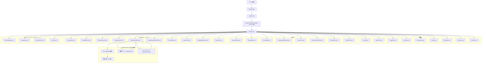

# AndroidLab 画面遷移図

```mermaid
flowchart TB
    A["アプリ起動"] --> B["MainActivity"]
    B --> C["AppContent"]
    C --> D["NavHost (startDestination = Route.Main)"]
    D --> M["MainScreen"]

    subgraph UI_BASIC["UI基礎"]
      T["TextScreen"]
      BTN["ButtonScreen"]
      IMG["ImageScreen"]
      INP["InputScreen"]
      LAY["LayoutsScreen"]
      LIST["ListScreen"]
      DIA["DialogScreen"]
      OTH["OtherScreen"]
      ST["StateScreen"]
    end

    subgraph UI_ADVANCED["UI応用"]
      ANI["AnimationScreen"]
      THEME["ThemingScreen"]
      TOUCH["TouchingScreen"]
      COL["CollapsingToolbarScreen"]
      CAN["CanvasScreen"]
      REO["ReorderableListScreen"]
      WEB["WebViewScreen"]
      ROU["RouletteScreen"]
    end

    subgraph ANDROID_FRAMEWORK["Androidフレームワーク"]
      LIFE["LifecycleScreen"]
      SIDE["SideEffectScreen"]
      PERM["PermissionsScreen"]
      NOTI["NotificationScreen"]
      AR["ActivityResultScreen"]
      SAVE["SavedInstanceStateScreen"]
      CAM["CameraScreen"]
      LOC["LocationScreen"]
      WORK["WorkManagerScreen"]
      SENSOR["SensorScreen"]
    end

    subgraph BACKEND_ARCH["バックエンドとアーキテクチャ"]
      NET["NetworkingScreen"]
      STO["StorageScreen"]
      DS["DataStoreScreen"]
      FLOW["FlowScreen"]
    end

    M --> T
    M --> BTN
    M --> IMG
    M --> INP
    M --> LAY
    M --> LIST
    M --> DIA
    M --> OTH
    M --> ST

    M --> ANI
    M --> THEME
    M --> TOUCH
    M --> COL
    M --> CAN
    M --> REO
    M --> WEB
    M --> ROU

    M --> LIFE
    M --> SIDE
    M --> PERM
    M --> NOTI
    M --> AR
    M --> SAVE
    M --> CAM
    M --> LOC
    M --> WORK
    M --> SENSOR

    M --> NET
    M --> STO
    M --> DS
    M --> FLOW

    subgraph ACTIVITY_RESULT_SUBFLOW["ActivityResultScreen内の遷移"]
      AR --> SA["SecondActivity起動"]
      SA --> ARR["結果を返して戻る"]
      AR --> PICK["画像ピッカー (GetContent)"]
      PICK --> AR
      AR --> FILE["ファイルピッカー (OpenDocument)"]
      FILE --> AR
    end
```

※この遷移図には、`ActivityResultScreen` 内のサブ遷移（`SecondActivity`・画像/ファイルピッカー）も含まれています。
